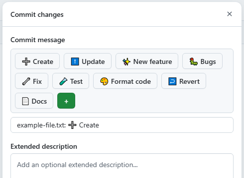
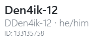

 

# OctaTils

---

## 🔎 About:
"OctaTils" is a userscript for the GitHub website that add some utils and tools

## ✨ Features:
* Commit and pull request message templates:

* User ID label in profile:

* Customization of element icons in the directory view <small><small>(Ability to configure via a dialog will be implemeted later)</small></small>

## 📦 Installization:
1. Install the userscript manager like 
2. Install userscript (octatils.**user**.js) from:
    * [Direct link (latest release)](https://github.com/DDen4ik-12/OctaTils/releases/latest/download/octatils.user.js)
    * [Releases](https://github.com/DDen4ik-12/OctaTils/releases)
  
## ⚓ License:
MIT, see [LICENSE](./LICENSE)